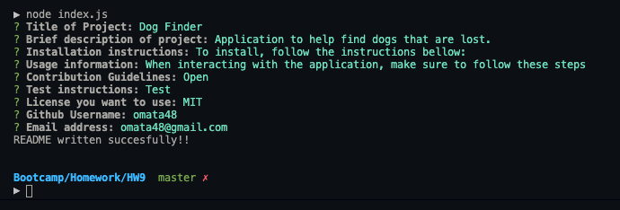
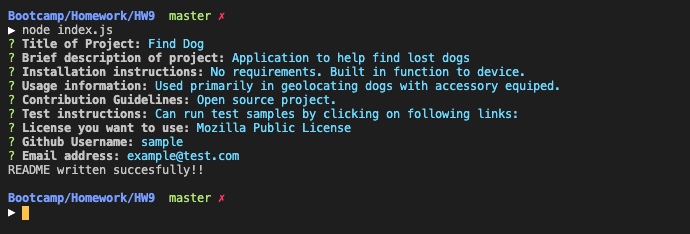

# README Generator

 
  
## Description
  
Creating a project always requires one item: a README document. This document is crucial to explain to potential users what an application is about and how to use it. This application helps a user create a README file in markdown by only interacting with the terminal.
  
## Table of Contents
  
[Installation](#Installation)  
[Usage](#Usage)  
[License](#License)  
[Contributing](#Contributing)  
[Tests](#Tests)  
[Questions](#Questions)  
  
## Installation 

The application requires the package.json file as it contains the required npm installed packages. 
Additionally, the utility generateMarkdown.js is needed in order to be able to generate the formated markdown document.  

  
## Usage

The program runs through the terminal. Using "inquire", the user is prompted for responses that will be used to format the finalized document.  

[Link to demo on Google Drive](https://drive.google.com/file/d/1MFja8C_a2_K_nEqpaG1HW_h0cSippCL8/view)

## License
  
Licensed under the [MIT](./LICENSE.txt) license.
  
## Contributing
  
Following the [Contributor Covenant](./contributorCovenant.txt)
  
## Tests
  
A test file was created in this repo under the name [Find Dog](./Find%20Dog.md)

This is what the user interacted with to create this sample file: 

  
## Questions

Link to my [GitHub Profile](https://github.com/omata48)
For additional questions feel free to email omata48@outlook.com